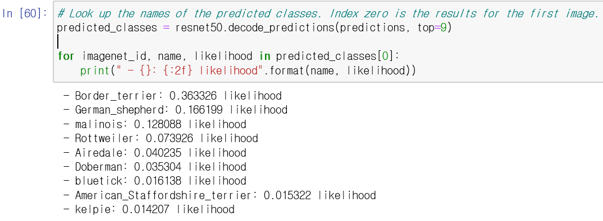

# __SSAFY AI Project__

---


## :strawberry: Installation

---

- **Bash 환경**에서 다음 명령어 실행

  `$ git clone https://lab.ssafy.com/s02-ai-sub2/s02p22a401.git`

- [https://i02lab1.p.ssafy.io/images.zip (4.07GB)](https://i02lab1.p.ssafy.io/images.zip) 에서 학습에 필요한 이미지 다운로드

- 필요한 **Python Package 설치**를 위해 Bash 환경에서 다음 명령어 실행

  (환경변수 Path에 Python 경로가 포함되어 있어야 실행 가능)

  ```bash
  $ pip install virtualenv
  $ virtualenv AI_venv --python=3.7
  $ source ./AI_venv/Scripts/activate
  
  # requirements.txt의 경로를 입력
  $ pip install -r (requirements.txt)
  ```


## :arrow_forward: Execution

---


## :memo: Requirement

---

### Req 1-1. 이미지 파일 로드

이미지 파일을 로드하는 함수를 구현한다 

  

이미지의 최대 크기가 가로세로 500,500임을 확인해 자동으로 빈 공간을 zero-padding해준다. 

구현된 결과는 아래와 같다. 


### Req 1-2. 이미지 RGB 정규화

이미지 전체의 평균,표준편차를 아래와 같은 코드로 계산한다 

 

 

  

계산된 결과는 아래와 같다. 

평균 :

 

표준편차 :  


### Req 4-1. Encoder 모델

사용방법 : Req4.py를 실행시킨다. --img_path 옵션으로 추출하고자 하는 이미지의 경로를 설정한다. 

기본적으로 강아지의 사진을 입력받는다. 

출력으로는 마지막 Dense Layer에서 추출하는 (1,1000) 벡터를 출력한다.

강아지의 사진을 분류한 결과는 아래와 같다. 




## :newspaper: Document

---

### :one: CNN

- [CNN이란](./doc/CNN/CNN이란.md)
- [CNN-최신모델](./doc/CNN/CNN-최신모델.md)

- [CNN_improvement_technique](./doc/CNN/cnn_improvement_technique.md)
- [모델 학습과정 시각화](./doc/CNN/모델_학습과정_시각화.md)

- [모델의 랜덤성과 저장](./doc/CNN/모델의_랜덤성과_저장.md)
- [Image Data Preprocessing](./doc/CNN/Image Data Preprocessing.md)
- [Jupyter Notebook](./doc/CNN/)


### :two: RNN

- [1-1 한국어 형태소 분석기 비교](./doc/RNN/1-1_한국어 형태소 분석기 비교.md)
- [1_Tokenization](./doc/RNN/1_Tokenization.md)
- [2_Integer Encoding](./doc/RNN/2_Integer Encoding.md)
- [3_WordEmbedding](./doc/RNN/3_WordEmbedding.md)
- [4_Recurrent_Neural_Network](./doc/RNN/4_Recurrent_Neural_Network.md)
- [5_LSTM](./doc/RNN/5_LSTM.md)
- [RNN_텍스트생성](./doc/RNN/RNN_텍스트생성.md)
- [Tokenization](./doc/RNN/tokenization.md)


### :three: Git Conventions

- [MCJ Git Conventions](./doc/Git_conventions/MCJ Git Conventions)


### :four: Node.js

- [Node.js Backend](./doc/Node.js/Node.js Backend.md)
- [Swagger+Node.js](./doc/Node.js/Swagger+Node.js.md)


### :five: Database Schema

- [Database Schema](./doc/Database/Database_Schema.png)
- [Database SQL](./doc/Database/Database_Sql.sql)


## :warning: Licence

---

[](https://www.gnu.org/licenses/agpl-3.0) [Affero General Public License](https://www.gnu.org/licenses/agpl-3.0.html)

- **상업적 이용 가능**
- **배포 및 수정 가능**
- **특허 신청 가능**
- **라이센스, 저작권 명시**
- **변경사항 안내**
- **보증 책임 없음, 2차 라이센스가 원작자에게 있음**
- **수정한 소스코드, AGPL 소스코드를 활용한 소프트웨어 전부를 AGPL로 항시 공개**


## :date: Jira

---

- https://jira.ssafy.com/projects/S02P22A401/


## :family: About Us

---

- **팀장 : 이수영**

  Git : https://lab.ssafy.com/SwimmingLee

- **팀원**

  - **김명수**

    Git : https://lab.ssafy.com/ZELDA

  - **김현철**

    Git : https://lab.ssafy.com/KimHyeonCheol

  - **안유림**

    Git : https://lab.ssafy.com/anyl92

  - **장현진**

    Git : https://lab.ssafy.com/steelfox

