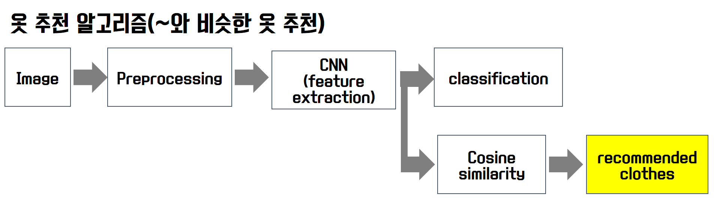
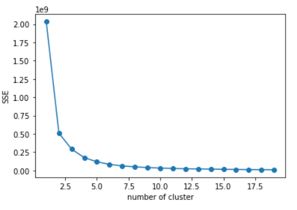

# LikeClothes PJT :shirt:


뭐 입을 지 고민된다고요? 앗차차... 옷 사는 데 돈이 많이 들어서 고민이라고요?  그럴 때는 좋아욧을 이용해보세요!

좋아욧은 **인공지능이 추천하는 나만의 맞춤형 옷을 구독하고 대여하는 서비스**에요. 좋아욧 서비스를 통해 매주마다 새롭게! 그리고 힙하게! 옷을 구독해서 입어봐요. 


**바로 가기**

 :mag_right: [LikeClothes 사용 설명서](#사용-설명서-open_hands:) <br>
 :mag_right: [핵심 인공지능 기술1 - 내 옷과 비슷한 옷 추천](#1.-~와-비슷한-추천) <br>
 :mag_right: [핵심 인공지능 기술2 - 내용 기반 필터링 추천](#2.-사용자-기록-기반-추천(내용-기반-필터링)) <br>
 :mag_right: [핵심 인공지능 기술3 - 협업 기반 필터링 추천]( #3.-사용자-기록-기반-추천(협업-필터링)) <br>
 :mag_right: [핵심 인공지능 기술4 - 내 옷과 어울리는 옷 추천](#4.-~와-어울리는-옷-추천) <br>
 :mag_right: [데이터베이스 스키마](#database-schema) <br>
 :mag_right: [LikeClothes 라이센스](#jira-date) <br>
 :mag_right: [저희가 궁금하다면](#about-us-family) <br>


## 사용 설명서 :open_hands:

### 설치하기

:point_right: **bash 환경**에서 다음 명령어 실행

  `$ git clone https://lab.ssafy.com/s02-ai-sub2/s02p23a401.git  ~/.` 


:point_right: 필요한 **Python Package 설치**를 위해 Bash 환경에서 다음 명령어 실행

(환경변수 Path에 Python 경로가 포함되어 있어야 실행 가능)

```bash
  $ pip install virtualenv
  $ virtualenv AI_venv --python=3.7
  $ source ./AI_venv/Scripts/activate
  
  # requirements.txt의 경로를 입력
  $ pip install -r (requirements.txt)
```


### 실행하기

 :point_right: Front-end

  ```bash
  $ cd ~/s02p23a401/front-end/
  $ npm install
  $ npm build // nginx 이용해서 배포가 아니라 로컬에서 실행 시에는 npm start
  ```


:point_right: Back-end

  ```bash
  $ cd ~/s02p23a401/back-end/
  $ npm install
  $ npm start
  ```


:point_right: AI-server

  ```bash
  $ cd ~/s02p23a401/back-end/
  $ gunicorn --bind 0.0.0.0:5000 wsgi:app
  ```

  

---

---

---


# 핵심 인공지능 기술

좋아욧에서 사용하는 추천 알고리즘 종류

- 사용자 기록 기반 추천(내용 기반 필터링)
- 사용자 기록 기반 추천(협업 필터링)
- ~와 비슷한 옷 추천
- ~와 어울리는 옷 추천 


## 1. ~와 비슷한 추천

인공지능을 통하여 비슷하지만 다른 옷을 추천하는 서비스에요.  옷을 찾아볼 때, 예쁘지만 뭔가 2% 부족하다고 느끼는 옷들이 있지 않으신가요? 그럴 때는 해당 옷과 비슷한 옷을 추천하는 좋아욧의 서비스를 이용해봐요!


비슷하지만 다른 옷을 추천하기 위해 아래와 같이 4단계 순서로 알고리즘을 진행합니다.

1. 이미지 전처리

2. CNN을 통한 이미지 피처 추출

3. 코사인 유사도기반의 피처 유사도 비교

4. 피처 유사도가 비슷한 옷 추천

   

비슷한 옷을 추천하기 위해서 CNN(Convolution Nenural Network)로 피처를 추출하고, 이를 기반으로 옷들간의 유사도를 판별하는 알고리즘입니다. 

### 추천 알고리즘 흐름도




VGG19모델을 저희의 클래스 분류에 맞춰 변형하였습니다. 변형된 모델을 바탕으로 전이 학습(Transfer Learning)을 진행하여 효과적으로 옷의 피처 정보를 추출하였습니다. 기존 VGG19 모델은 softmax 아웃풋 레이어를 통해 1000개의 클래스를 분류합니다.  본 서비스에 맞도록 모델을 변형하기 위해 기존 아웃풋 레이어층을 날리고 40개의 옷 분류 클래스로 구분하는 층을 새롭게 추가하였습니다. 새로운 아웃풀 레이어를 추가한 변형된 VGG19모델을 이용하여 트레이닝하여 피처를 추출하였습니다.

### 추천 알고리즘 시각화 


## 2. 사용자 기록 기반 추천(내용 기반 필터링)

아래와 같은 내용을 기반으로 추천해드립니다.

- 위시리스트
- (회원가입 시 선택한) 선호 옷
- 팔로우 
- 유저 기록(클릭)


레코드 옷 정보, 선호 옷 정보, 위시 리스트 옷 정보에 대해 가중치를 반영하여 옷을 추출하고 그에 따라 추천 알고리즘을 진행합니다. 선호하는 옷, 위시 리스트를 통해 유저와 같이 유저가 직접 고른 옷을 피처로 사용하기 뿐만 아니라  최근의 본 옷 데이터를 추출하여 유행에 따라 취향이 변경되는 것을 반영합니다. 

   


## 3. 사용자 기록 기반 추천(협업 필터링)

사용자가 최근에 본 옷 정보를 확인하여 얼마나 자주 해당 옷들을 검색하고 찾아보는 지 정보를 수집합니다. 즉, 사용자 기록 누적 정보를 통해 각각의 유저들이 얼마나 어떤 카테고리의 옷들을 찾아보고 있는지 확인합니다. 이렇게 유저가 검색한 옷들을 누적한 정보를 피처(차원)으로 생각하고 각각의 유저들마다 클러스트링하여 유저 그룹을 만듭니다. 그래서 나와 비슷한 취향을 가지고 있는 사람이 구독하고 있는 옷, 나랑 비슷한 취향을 가지고 있는 사람이 위시 리스트에 담고 있는 옷 등 정보를 유저에게 보여줄 수 있도록 합니다. 따라서 유저는 내가 직접 보지는 않지만, 나랑 비슷한 옷 취향을 가지고 있는 사람이 어떤 옷들을 구독하는지 정보르르 바탕으로 맞춤형 옷을 추천해줍니다. 


## 4. ~와 어울리는 옷 추천

미리 작성한 AVM(Aattribute Values Matrix)를 바탕으로 어울리는 옷 카테고리는 찾아서 추천해줍니다. 남자 상의에 여자 원피스를 추천할 수는 없으니, 유저 경험을 부탕으로 AVM을 작성하여 어떤 카테고리가 어울리는지 추출합니다. 


## 클러스터링

유저가 어떤 종류의 옷을 자주 검색하고 클릭하느냐에 따라 클러스트링을 진행합니다.  클러스터링을 통해 비슷한 취향을 가진 유저 그룹을 판별합니다. 유저는 자신과 비슷한 취향을 가진 사람들이 어떤 옷을 선호하고 구독하고 있는지에 따라 옷을 추천받을 수 있습니다.

본 서비스에서는 여러 군집 알고리즘 중 계산 효율성이 높고 구현이 간단한 프로토 타입 기반 군집(prototype-based clustering)중 하나인 KMeans 알고리즘을 사용합니다.

### KMeans 최적화 

K-means는 원형 클러스터를 구분하는 데 뛰어나지만, 사전에 클러스터 개수 k를 지정해야 합니다. k의 선정에 따라 클러스터링 결과가 매우 달라질 수 있기 때문에 좋아욧 서비스에 적용할 때 최적의 k를 구하기 위해 여러 분석을 진행하였습니다. 

#### 엘보우 방법을 이용한 최적의 클러스터 개수 찾기 

 



k의 갯수를 증가시키면서 클러스터 관성(Cluster inertia) 가 어떻게 변화하는지 살펴보았습니다. 엘보우 방법은 일반적으로 k가 증가하면 클러스터 간의 거리가 좁아지기 때문에 왜곡이 점점 작아지게 됩니다. k가 증가함에 따라 왜곡 이 따르게 감소하는 지점을 찾아서 k을 선정하였습니다. 위 도표에서 보이는 바와 같이 [4-6] 범위의 k가 적합하다고 판단하였으며, 이를 이용하여 실루엣 그래프로 군집 품질을 정규화 하였습니다.


#### 실루엣 그래프를 이용한 군집 품질 정규화


실루엣 그래프를 이용하여 k에 따른 품질을 판단하였으며, 두께와 길이가 일정한 k = 6으로 선전하여 좋아욧 서비스에 적용하였습니다. 


# Database schema

디비 스키마는 아래와 같이 구성하였습니다.  


## Licence :warning:

---

[](https://www.gnu.org/licenses/agpl-3.0) [Affero General Public License](https://www.gnu.org/licenses/agpl-3.0.html)

- **상업적 이용 가능**
- **배포 및 수정 가능**
- **특허 신청 가능**
- **라이센스, 저작권 명시**ㄴㄴ
- **변경사항 안내**
- **보증 책임 없음, 2차 라이센스가 원작자에게 있음**
- **수정한 소스코드, AGPL 소스코드를 활용한 소프트웨어 전부를 AGPL로 항시 공개**


# Jira :date: 

---

- https://jira.ssafy.com/projects/S02P23A401/


# About Us :family:

---

- **팀장 : 이수영**

  Git : https://lab.ssafy.com/SwimmingLee

- **팀원**

  - **김명수**

    Git : https://lab.ssafy.com/ZELDA

  - **김현철**

    Git : https://lab.ssafy.com/KimHyeonCheol

  - **안유림**

    Git : https://lab.ssafy.com/anyl92

  - **장현진**

    Git : https://lab.ssafy.com/steelfox