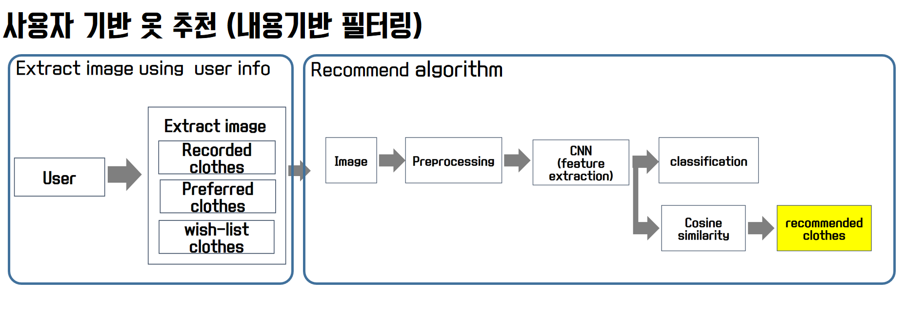

# LikeClothes PJT :shirt:


다양한 옷을 구독받아서 사용하고 싶을 때는 좋아욧으로 오세요!

좋아욧은 우리가 보고 싶은 옷을 인공지능 기반으로 추천해줍니다. 빠르게 **내 상황에 맞는 최적의 **이에요.

page에서 어떻게	보여지는 지 여기에 사진 


[[__TOC__]]

**바로 가기**


 :mag_right: [LikeClothes 사용 설명서](#id-section1) <br>
 :mag_right: [핵심 인공지능 기술1 - 내 옷과 비슷한 옷 추천](#1.-~와-비슷한-추천) <br>
 :mag_right: [핵심 인공지능 기술2 - 내용 기반 필터링 추천](#2.-사용자-기록-기반-추천(내용-기반-필터링)) <br>
 :mag_right: [핵심 인공지능 기술3 - 협업 기반 필터링 추천]( #3.-사용자-기록-기반-추천(협업-필터링)) <br>
 :mag_right: [핵심 인공지능 기술4 - 내 옷과 어울리는 옷 추천](#4.-~와-어울리는-옷-추천) <br>
 :mag_right: [데이터베이스 스키마](#database-schema) <br>
 :mag_right: [LikeClothes 라이센스](#jira-date) <br>
 :mag_right: [저희가 궁금하다면](#about-us-family) <br>


## 사용 설명서 :open_hands:

### 설치하기

:point_right: **bash 환경**에서 다음 명령어 실행

  `$ git clone https://lab.ssafy.com/s02-ai-sub2/s02p23a401.git  ~/.` 


:point_right: 필요한 **Python Package 설치**를 위해 Bash 환경에서 다음 명령어 실행

(환경변수 Path에 Python 경로가 포함되어 있어야 실행 가능)

```bash
  $ pip install virtualenv
  $ virtualenv AI_venv --python=3.7
  $ source ./AI_venv/Scripts/activate
  
  # requirements.txt의 경로를 입력
  $ pip install -r (requirements.txt)
```


### 실행하기

 :point_right: Front-end

  ```bash
  $ cd ~/s02p23a401/front-end/
  $ npm install
  $ npm build // nginx 이용해서 배포가 아니라 로컬에서 실행 시에는 npm start
  ```


:point_right: Back-end

  ```bash
  $ cd ~/s02p23a401/back-end/
  $ npm install
  $ npm start
  ```


:point_right: AI-server

  ```bash
  $ cd ~/s02p23a401/back-end/
  $ gunicorn --bind 0.0.0.0:5000 wsgi:app
  ```

  

---

---

---

s


# 핵심 인공지능 기술

- 사용자 기록 기반 추천(내용 기반 필터링)
- 사용자 기록 기반 추천(협업 필터링)
- ~와 비슷한 옷 추천
- ~와 어울리는 옷 추천 


## 1. ~와 비슷한 추천

인공지능 기반으로 이 옷과 비슷한 이런 옷은 어때요? 라는 식으 서비스. 

### 추천 알고리즘 흐름도


### 추천 알고리즘 시각화 


## 2. 사용자 기록 기반 추천(내용 기반 필터링)

어떤 데이터를 기반으로 ? 

- 위시리스트
- (회원가입 시 선택한) 선호 옷
- 팔로우 
- 유저 기록(클릭)




## 3. 사용자 기록 기반 추천(협업 필터링)


## 4. ~와 어울리는 옷 추천

미리 작성한 attribute values matrix를 바탕으로 어울리는 옷 카테고리는 찾아서 추천해준다. (남자 상의에 여자 원피스를 추천할 수는 없으니까..!) 


# Database schema

디비 스키마 


## Licence :warning:

---

[](https://www.gnu.org/licenses/agpl-3.0) [Affero General Public License](https://www.gnu.org/licenses/agpl-3.0.html)

- **상업적 이용 가능**
- **배포 및 수정 가능**
- **특허 신청 가능**
- **라이센스, 저작권 명시**ㄴㄴ
- **변경사항 안내**
- **보증 책임 없음, 2차 라이센스가 원작자에게 있음**
- **수정한 소스코드, AGPL 소스코드를 활용한 소프트웨어 전부를 AGPL로 항시 공개**


# Jira :date: 

---

- https://jira.ssafy.com/projects/S02P23A401/


# About Us :family:

---

- **팀장 : 이수영**

  Git : https://lab.ssafy.com/SwimmingLee

- **팀원**

  - **김명수**

    Git : https://lab.ssafy.com/ZELDA

  - **김현철**

    Git : https://lab.ssafy.com/KimHyeonCheol

  - **안유림**

    Git : https://lab.ssafy.com/anyl92

  - **장현진**

    Git : https://lab.ssafy.com/steelfox