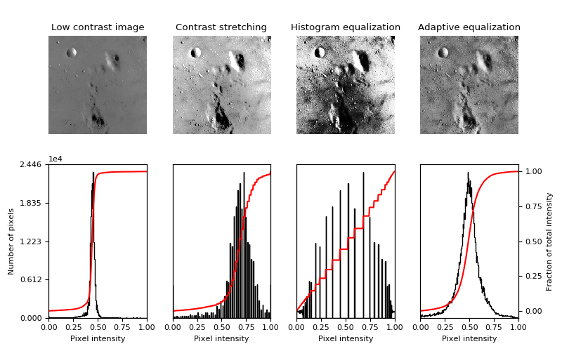
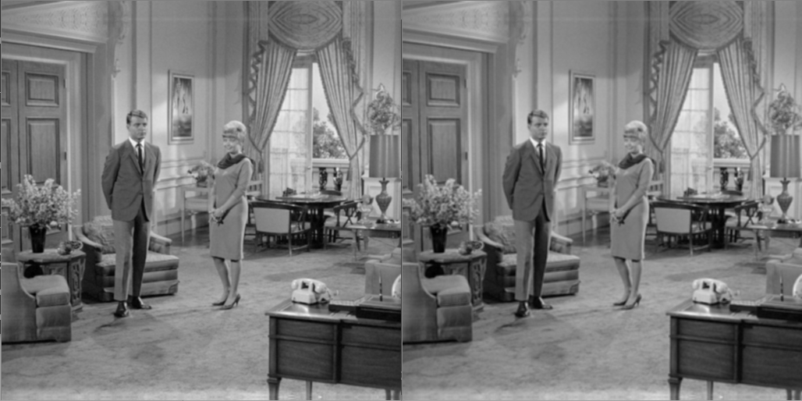

# __Image Data Preprocessing__

---

 CNN 이미지 전처리 과정 및 모델 설계 과정에서 어떤 요소들이 고려되어야 하는지에 대해서 다뤄보도록 하겠다.

- ### 정규화(Normalization)??

    사용하고자 하는 데이터의 범위를 원하는 범위의 값으로 변경하는 과정을 정규화(Normalization) 라고 함.

   보통 RGB 값에서 픽셀 값은 0 ~ 255 사이의 값으로 표현되므로, 이 값을 0 ~ 1 사이의 실수 값으로 변경한다.

   

- ### 표준화(Standardization)

     보통 표준화(Standardization) 과정까지를 합쳐 정규화라고 하는 경우가 많다. 이를 z-transformation이라 하기도 하며, 이렇게 표준화된 값을 z-score라고 한다. 일반적인 이미지 데이터 처리에 이용되는 방식이며, 평균과의 차이를 표준편차로 나눈 값으로 나타낼 수 있다.
     
     

- ### Python에서의 정규화, 표준화

    python에서 정규화 및 표준화 과정은 numpy의 mean(), std(), var() 등을 이용해 표준화할 수도 있으며, 이 밖에도 scipy.stat의 norm(), zscore(), sklearn.preprocessing의 fit_transform()을 이용해서도 표준화가 가능하다.

   ```python
   import numpy as np
   
   # Numpy Array Data Standardization
   # z = (x - mean()) / std()
   standardized_data = (data - np.mean(data, axis=0)) / np.std(data, axis=0)
   
   # Numpy Array Data Normalization
   # n = (data - Min) * (newMax - newMin) / (Max - Min) + newMin
   
   # Normalize to (0 ~ 1)
   mx, mn = data.max(), data.min()
   normalized_data = data - mn / mx - mn
   
   # < Code 1 : 1-dimensional array Normalization & Standardization >
   ```

   

- ### 이미지 전처리(Image Preprocessing)

  위의 과정 뿐 아니라 training model 에서의  이미지의 전처리 또한 training data 의 학습 성능에 큰 영향을 미친다. 보통 Keras 패키지를 이용해 데이터 분류 모델을 설계할 것이다.

  하지만 오늘 다뤄볼 내용은 이미지 전처리 과정이 아닌, 이미지 필터링에 대해서 알아보기로 하자.

  

  - __Histogram Equalization__

  

  Histogram Equalization은 이미지를 전처리하는 방법 중 하나로, 정규화의 일종이다. 위 그림처럼 이미지의 contrast(대비)가 적은 상황에 유용하게 사용할 수 있는 방법이다. 대체로 너무 밝거나 너무 어두운 이미지 등에 사용할 수 있다.

  ```python
  import numpy as np
  import matplotlib.image as mpimg
  import matplotlib.pyplot as plt
    
  image = mpimg.imread("./image/Lenna.jpg")
    
  # plot 1 - Lenna(Original)
  plt.subplot(121), plt.imshow(image), plt.title('Lenna(Original)')
    
  # plot 2 - Lenna(Equalized)
  hist, bins = np.histogram(image.flatten(), 256,[0,256])
  cdf = hist.cumsum()
  cdf_m = np.ma.masked_equal(cdf, 0)
  cdf_m = (cdf_m - cdf_m.min())*255/(cdf_m.max()-cdf_m.min())
  cdf = np.ma.filled(cdf_m,0).astype('uint8')
  image = cdf[image]
    
  plt.subplot(122), plt.imshow(image), plt.title('Lenna(Equalized)')
    
  plt.show()
    
  # < Code 2 : Histogram Equalization - 1 >
  ```

  ```python
  import matplotlib
  import matplotlib.pyplot as plt
  import numpy as np
  
  from skimage import data, img_as_float
  from skimage import exposure
  
  
  matplotlib.rcParams['font.size'] = 8
  
  def plot_img_and_hist(image, axes, bins=256):
      """Plot an image along with its histogram and cumulative histogram.
  
      """
      image = img_as_float(image)
      ax_img, ax_hist = axes
      ax_cdf = ax_hist.twinx()
  
      # Display image
      ax_img.imshow(image, cmap=plt.cm.gray)
      ax_img.set_axis_off()
  
      # Display histogram
      ax_hist.hist(image.ravel(), bins=bins, histtype='step', color='black')
      ax_hist.ticklabel_format(axis='y', style='scientific', scilimits=(0, 0))
      ax_hist.set_xlabel('Pixel intensity')
      ax_hist.set_xlim(0, 1)
      ax_hist.set_yticks([])
  
      # Display cumulative distribution
      img_cdf, bins = exposure.cumulative_distribution(image, bins)
      ax_cdf.plot(bins, img_cdf, 'r')
      ax_cdf.set_yticks([])
  
      return ax_img, ax_hist, ax_cdf
  
  
  # Load an example image
  img = "./image/Lenna.jpg"
  
  # Contrast stretching
  p2, p98 = np.percentile(img, (2, 98))
  img_rescale = exposure.rescale_intensity(img, in_range=(p2, p98))
  
  # Equalization
  img_eq = exposure.equalize_hist(img)
  
  # Adaptive Equalization
  img_adapteq = exposure.equalize_adapthist(img, clip_limit=0.03)
  
  # Display results
  fig = plt.figure(figsize=(8, 5))
  axes = np.zeros((2, 4), dtype=np.object)
  axes[0, 0] = fig.add_subplot(2, 4, 1)
  for i in range(1, 4):
      axes[0, i] = fig.add_subplot(2, 4, 1+i, sharex=axes[0,0], sharey=axes[0,0])
  for i in range(0, 4):
      axes[1, i] = fig.add_subplot(2, 4, 5+i)
  
  ax_img, ax_hist, ax_cdf = plot_img_and_hist(img, axes[:, 0])
  ax_img.set_title('Low contrast image')
  
  y_min, y_max = ax_hist.get_ylim()
  ax_hist.set_ylabel('Number of pixels')
  ax_hist.set_yticks(np.linspace(0, y_max, 5))
  
  ax_img, ax_hist, ax_cdf = plot_img_and_hist(img_rescale, axes[:, 1])
  ax_img.set_title('Contrast stretching')
  
  ax_img, ax_hist, ax_cdf = plot_img_and_hist(img_eq, axes[:, 2])
  ax_img.set_title('Histogram equalization')
  
  ax_img, ax_hist, ax_cdf = plot_img_and_hist(img_adapteq, axes[:, 3])
  ax_img.set_title('Adaptive equalization')
  
  ax_cdf.set_ylabel('Fraction of total intensity')
  ax_cdf.set_yticks(np.linspace(0, 1, 5))
  
  # prevent overlap of y-axis labels
  fig.tight_layout()
  plt.show()
  
  # < Code 3 : Histogram Equalization - 2 >
  ```

  하지만 Histogram Equalization이 모든 데이터에 대해서 좋은 모델을 제공하지는 않는다. 예를 들어, 속도 제한 표지판 인식 모델의 전처리 과정에 Histogram Equalization을 사용했을 때, 대비가 좋지 않은 데이터임에도 불구하고 판단해야 하는 데이터가 표지판의 내용이다 보니 정확도가 떨어지는 모습을 보이기도 했다.

  

  - __가우시안 필터(Gaussain filter, 가우시안 블러)__

  

  가우시안 필터는 가우시안 분포를 이미지 처리에 적용한 것으로, 선형 필터이다. 이미지를 흐리게 하거나 노이즈를 줄이는 데에 사용하며, Lane Detection을 이용한 DL modeling에서 매우 중요한 요소 중 하나이다.

  ```python
  import matplotlib.image as mpimg
  import matplotlib.pyplot as plt
  from skimage import filters
  
  image = mpimg.imread("./image/Lenna.jpg")
  
  # plot 1 - Lenna(Original)
  plt.subplot(121), plt.imshow(image), plt.title('Lenna(Original)')
  
  # plot 2 - Lenna(Equalized)
  image = filters.gaussian(image, sigma=5)
  plt.subplot(122), plt.imshow(image), plt.title('Lenna(Gaussian Blur)')
  
  plt.show()
  
  # < Code 4 : Gaussian Filter >
  ```


### [ 출처 ]

[Histogram Equalization]
https://scikit-image.org/docs/stable/auto_examples/color_exposure/plot_equalize.html

[OpenCV Image Filter]
https://figureking.tistory.com/215

[Keras Modeling]
https://keraskorea.github.io/posts/2018-10-24-little_data_powerful_model/

[Related Articles]
랜덤 포레스트 분류기 기반의 컨벌루션 뉴럴 네트워크를 이용한 속도 제한 표지판 인식, 저) 이은주 외 2명

추후 내용 추가...