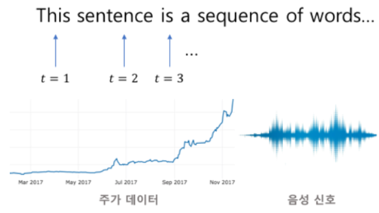
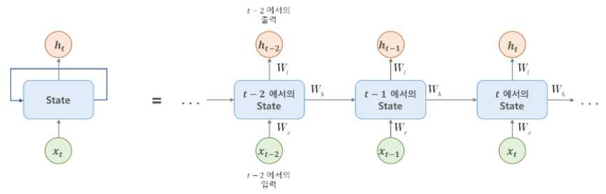
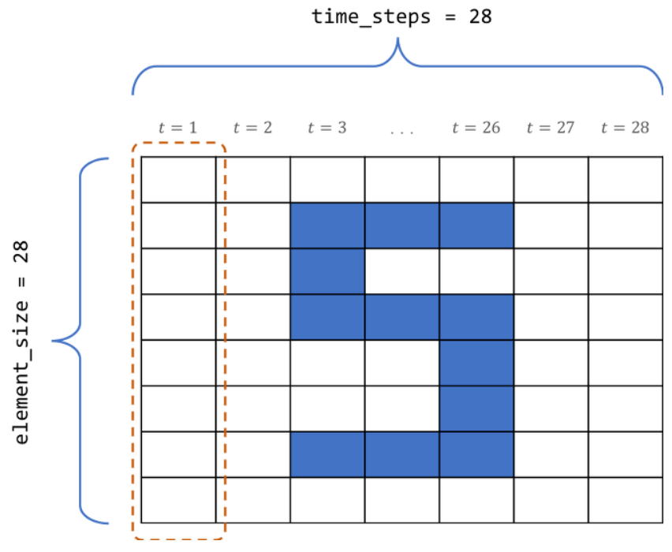

# 순환 신경망(RNN, Recurrent Neural Network)

시퀀스(Sequence) 데이터 : 각각의 데이터가 순서가 있는 데이터
자연어(NL, Natural Language), 음성신호, 주식 등 연속적인 데이터에 적합한 모델




```RNN모델의 바탕에는 시퀀스에서 현재 이후의 각 데이터는 새로운 정보를 제공하므로, 이 정보로 모델의 현재 상태를 갱신(업데이트) 한다는 아이디어가 깔려 있다. 어떤 텍스트에서 문장을 읽을 때 각각의 새로운 단어로 현재 상태의 정보가 갱신되는데, 이 상태는 새롭게 나타난 단어 뿐만 아니라 이전의 단어에 대해서도 종속적이다. ```


통계 및 확률 기반의 **[마르코프 체인](https://brunch.co.kr/@geumjaelee/2) 모델**
데이터 시퀀스를 체인으로 본다면, 체인의 각 노드는 이전 노드로부터 어떤 식으로든 종속적이므로 '과거'는 지워지지 않고 이어진다.

#### 메모리 셀

```타임 스텝 t에서 순환 뉴런의 출력은 이전 타임 스텝의 모든 입력에 대한 함수이기 때문에 이것을 메모리라고 볼 수 있다. 이렇게 타임 스텝에 걸쳐 어떠한 상태를 보존하는 신경망의 구성 요소를 메모리 셀(memory cell) 또는 셀(cell)이라고 한다. 일반적으로 타임 스텝 t에서 셀의 상태 h_t(h = hidden)는 아래의 식과 같이 타임 스텝에서의 입력과 이전 타임 스텝의 상태에 대한 함수이다.```



```위의 그림에서 볼 수 있듯이, t시점 에서 네트워크는 입력값 x_t(문장 중 하나의 단어)를 관찰하고, '상태 벡터'(state vector, t시점의 출력)를 이전의 h_(t-1)에서 h_t로 업데이트 한다. 새로운 입력(다음 단어)은 t-1, t-2, ...에서 관찰한 이전 입력이 현재(t) 입력의 이해에 영향을 미치므로 과거 시퀀스에 종속적이다. 위의 그림에서 처럼, 이러한 순환구조를 길게 펼쳐놓은 체인으로 생각할 수 있다.```


[TensorFlow를 사용해 시퀀스 데이터를 다루는 방법](https://excelsior-cjh.tistory.com/154?category=940399)을 통해 기초적인 RNN을 구현해보자

숫자의 모양도 RNN의 적용이 가능하다!



## 텍스트 시퀀스용 RNN

텍스트 시퀀스는 문장을 구성하는 단어들, 문단을 구성하는 문장들, 단어를 구성하는 문자들, 또는 하나의 전체 문서 등에 적용 가능. 위의 동일한 링크에서 마찬가지로 공부 가능하다.

RNN의 구현 소스코드는 [여기](https://excelsior-cjh.tistory.com/183?category=940400)를 참조하여 공부할 수 있으나, 우선 구체적인 내용은 넘어가도록 한다. 필요하다면 돌아와서 학습하자.