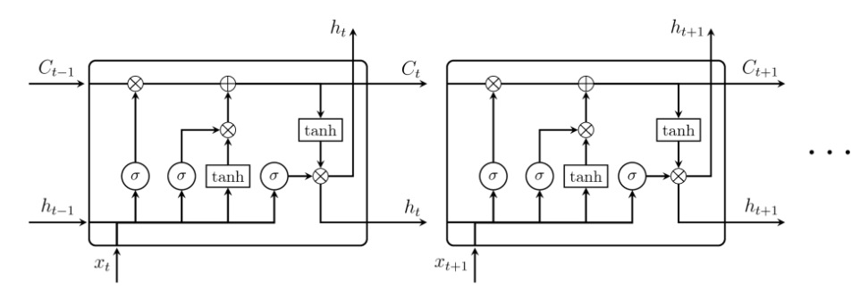

# LSTM(Long Short-Term Memory)

### 배경 - RNN의 한계

1. 오늘은 하늘이 ___
   - 현재 시점을 예측하는 데 필요한 문맥이 가까이 있고, 많지 않기에 RNN으로 학습 가능
2. 당신은 20명을 태운 버스를 운행하고 있습니다. 이번 정류장에서 5 명이 내렸고, 3명이 탔습니다. 다음 정류장에서는 7명이 내리고, 4명이 탔습니다. 그리고 그 다음 정류장에서는 1명이 내리고, 3명이 탔습니다. 그리고, 버스 기사의 나이는 __ 입니다.
   - 정보를 필요로하는 시점과, 필요한 정보가 멀리 떨어져 있다면 예측 불가능
   - 이를 **Long-Term Dependency**라 한다.

#### LSTM의 목적 : 멀리 떨어져 있는 정보 또한 활용하도록 학습

#### 모델

1. 망각게이트(forget gate)
   t시점을 기준으로, x_t와 h_(t-1)을 입력으로 받아 이전 셀의 정보를 망각할지 말지 결정
   현재의 정보가 중요하면 이전의 정보를 잊게 하고, 현재의 정보가 필요 없다면 이전의 정보를 기억하도록
2. 입력 게이트
   t시점을 기준으로, x_t와 h_(t-1)을 입력으로 받아 **현재의 정보를 다음 시점으로 전해질 cell state에 얼마나 반영할지 결정**
3. cell state 갱신
   t시점을 기준으로, x_t와 h_(t-1)을 입력으로 받아 하이퍼탄젠트 함수를 사용해 입력게이트의 출력과 Hadamard 곱을 한다. 이 값과 망각게이트 출력을 이용해 cell state를 변경한다.
4. 현재 셀h_t의 출력값 계산
   LSTM은 4개의 가중치 셋을 가진다
   W_f(forget) b_f, W_i(input) b_u, W_C(cell state) b_C, W_o(출력값) b_o

[실습해보자](https://datascienceschool.net/view-notebook/770f59f6f7cc40c8b6dc98dddd06c6c5/)

