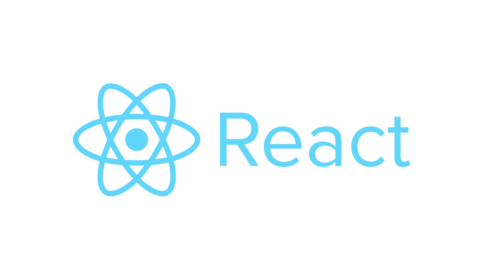

# React Frontend

## 1. React

  자바스크립트 라이브러리의 하나로서 사용자 인터페이스를 만들기 위해 사용되는 소프트웨어 플랫폼. 2011년 페이스북의 뉴스피드에 처음 적용, 2012년 인스타그램에 적용, 2013년 5월 JSConf US에서 오픈 소스화 되었다. 



- **설치**

  1. Node.js / npm

  Babel, Webpack 등을 사용하기 위해 설치한다. [Node.js Download Link](https://nodejs.org/ko/download/)

  버전을 확인한다.

  ```shell
  node -v
  npm -v
  ```

  2. yarn

  npm은 의존하는 라이브러리 개수가 많으면 속도가 저하된다. 성능을 위해 yarn 도구도 설치해준다. [yarn Download Link](https://classic.yarnpkg.com/en/docs/install#windows-stable)

  버전을 확인한다. 확인되지 않는다면 환경변수를 \bin 디렉토리까지 잡아준다.

  ```
  yarn -v
  ```

- **프로젝트 생성**

  ```shell
  create-react-app .
  npm start / yarn start
  ```

  

## 2. React의 특징

- **속성과의 단방향 데이터 바인딩**: *props* 속성들은 부모 컴포넌트로부터 컴포넌트에 전달된다. 컴포넌트들은 props를 하나의 불변의 값(객체)들로 받는다.
- **스테이트풀 컴포넌트**: 상태를 컴포넌트를 통해 값을 보관하며 props로 차일드 컴포넌트로 전달할 수 있다.
- **가상 DOM**: 인 메모리 데이터 구조 캐시를 만들고 결과 차이를 계산한 다음 브라우저에 표시되는 DOM을 효과적으로 업데이트한다. 실제로 변경되는 하위 컴포넌트만을 렌더링한다.
- **라이프사이클 메서드**: 컴포넌트가 생존하는 동안 셋 포인트(set point)에 코드를 실행할 수 있게 하는 훅(hook)이다.
  - `shouldComponentUpdate` 렌더가 불필요한 경우 false를 반환함으로써 개발자가 컴포넌트의 불필요한 재렌더링을 막을 수 있게 한다.
  - `componentDidMount` 컴포넌트가 '마운트'되면 호출된다. API를 통해 원격 소스로부터 로드되는 데이터를 트리거하기 위해 보통 사용된다.
  - `render` 컴포넌트의 상태가 업데이트될 때마다 호출되는 것이 보통이며 사용자 인터페이스의 변경사항을 반영한다.
- **JSX**: 자바스크립트 언어 문법의 확장이다. 컴포넌트 렌더링을 구조화하는 방법을 제공한다.

- **자바스크립트 식**: 중괄호 `{}`를 사용하여 JSX 안에 쓸 수 있다


## 3. React의 장단점

- **장점**
  - React는 JavaScript 객체 형태의 Virtual DOM 을 사용하여 어플리케이션의 성능을 향상시킴 (JavaScript Virtual DOM 처리가 실제 DOM 보다 빠르기 때문)
  - 서버 & 클라이언트 사이드 렌더링 지원을 통해 브라우저측의 초기 렌더링 딜레이를 줄이고, SEO 호환도 가능해짐
  - Component 의 가독성이 매우 높고 간단하여 쉬운 유지보수, 간편한 UI 수정 및 재사용 용이
  - React는 프레임워크가 아닌 라이브러리기 때문에 다른 프레임워크와 혼용 가능
- **단점**
  - VIEW ONLY , VIEW 이외의 기능은 써드파티 라이브러리(Third party library, =패키지, 모듈로 불리기도함)를 이용하거나 직접 구현해야함
  - IE8 이하 지원하지 않음 (IE8 이하 버전을 지원해야 할 경우 v0.14 버전을 사용 해야함)
  - React는 inline-template 과 JSX 를 사용하는데, 일부 개발자들에게는 적응이 안 될 수 있음


## [ References ]

[위키백과-리액트(자바스크립트 라이브러리)]([https://ko.wikipedia.org/wiki/%EB%A6%AC%EC%95%A1%ED%8A%B8_(%EC%9E%90%EB%B0%94%EC%8A%A4%ED%81%AC%EB%A6%BD%ED%8A%B8_%EB%9D%BC%EC%9D%B4%EB%B8%8C%EB%9F%AC%EB%A6%AC)](https://ko.wikipedia.org/wiki/리액트_(자바스크립트_라이브러리))

[React 완벽정리 (react란? 장점, 단점 등)](https://hyejin-dev.tistory.com/3)


