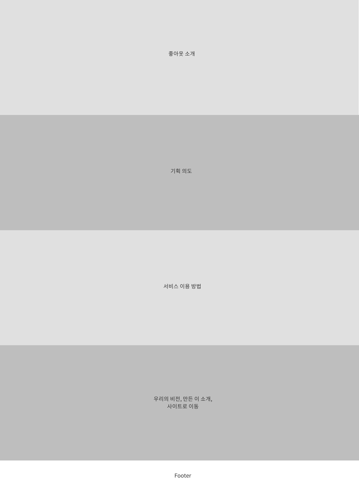
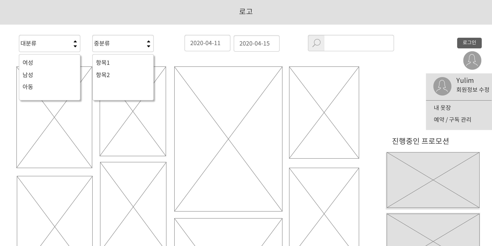
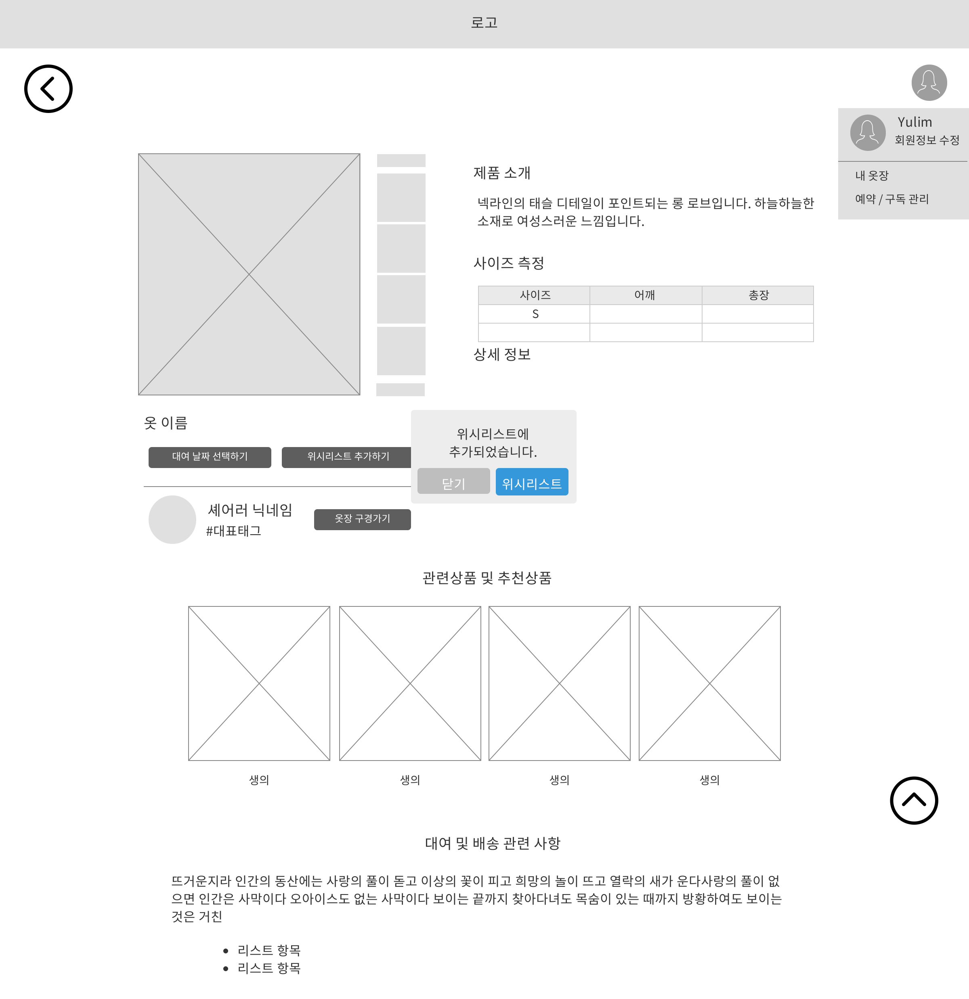
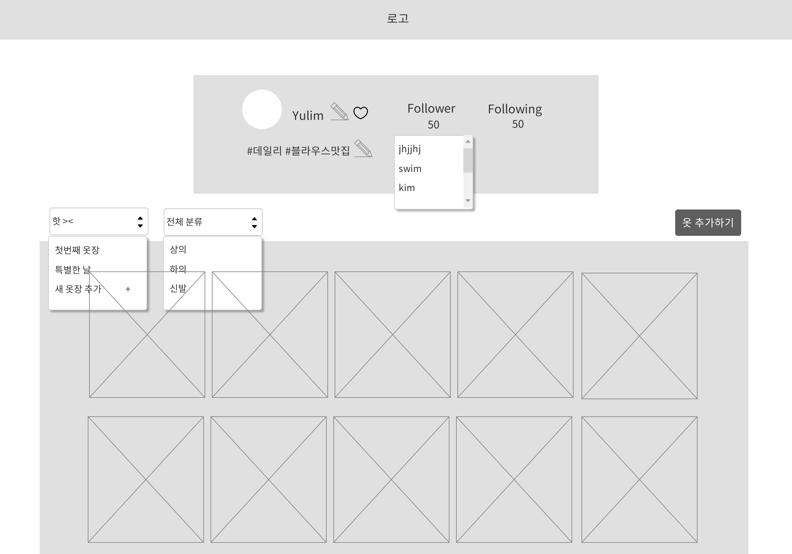
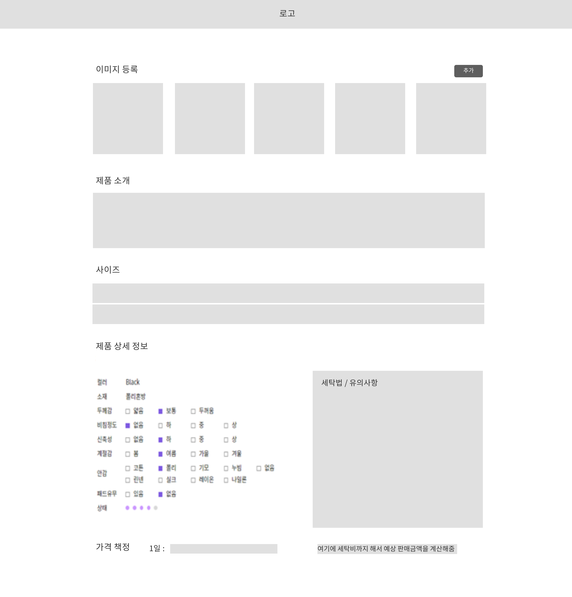
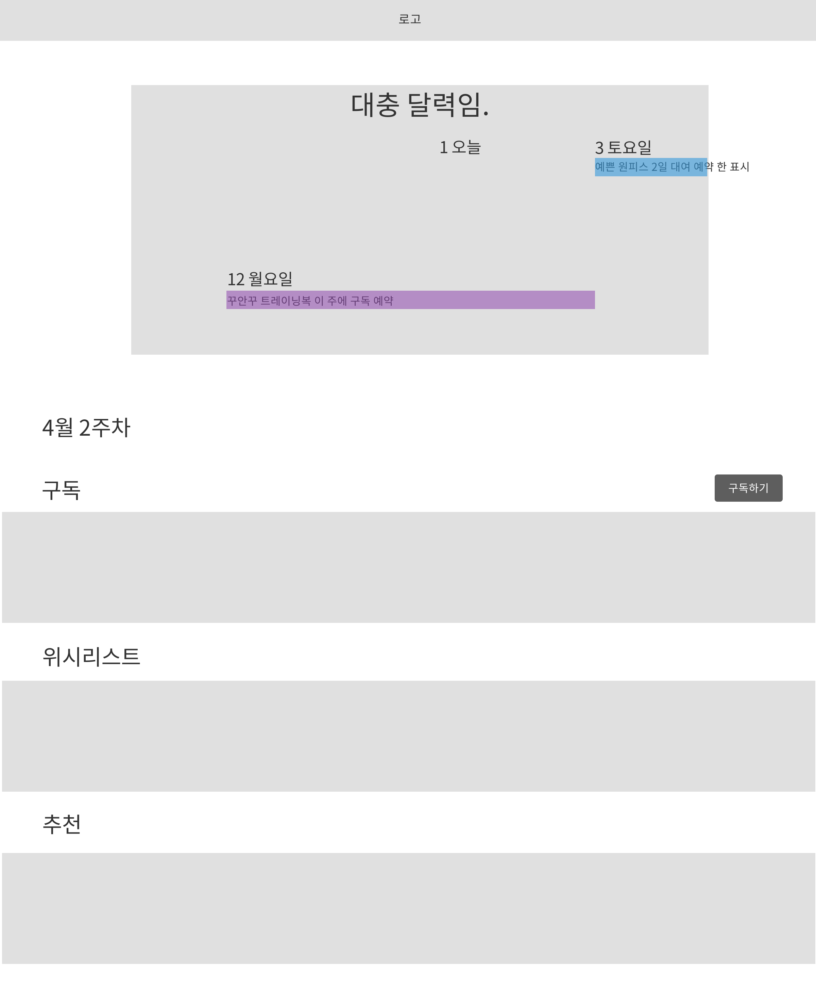
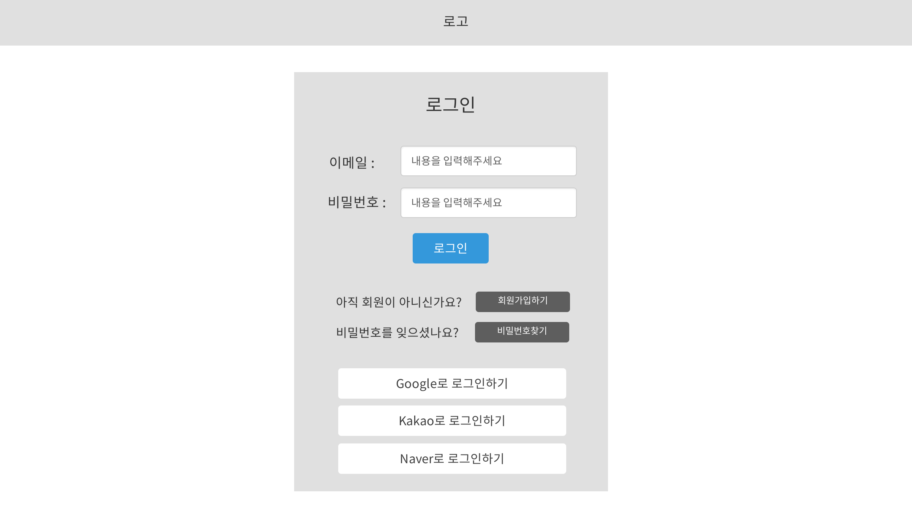
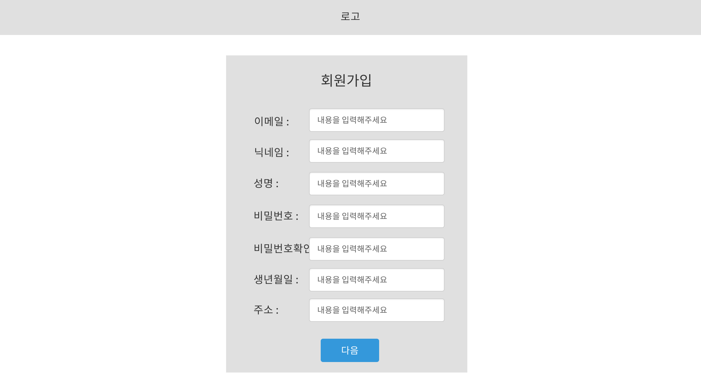
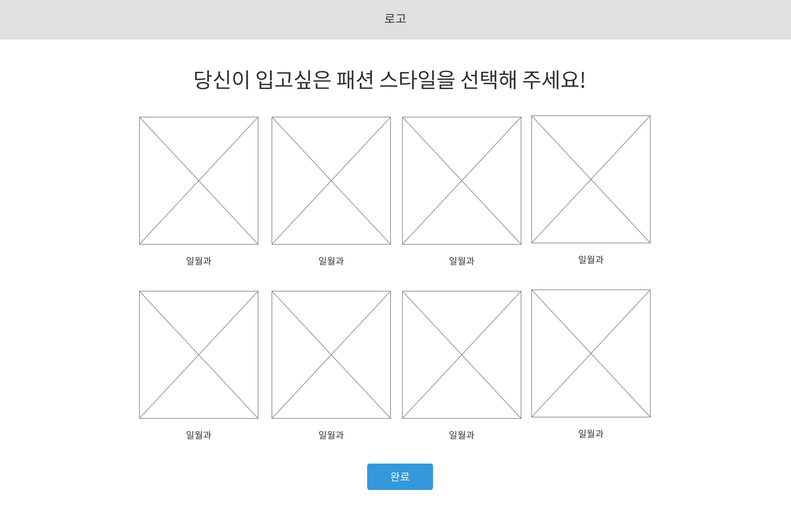
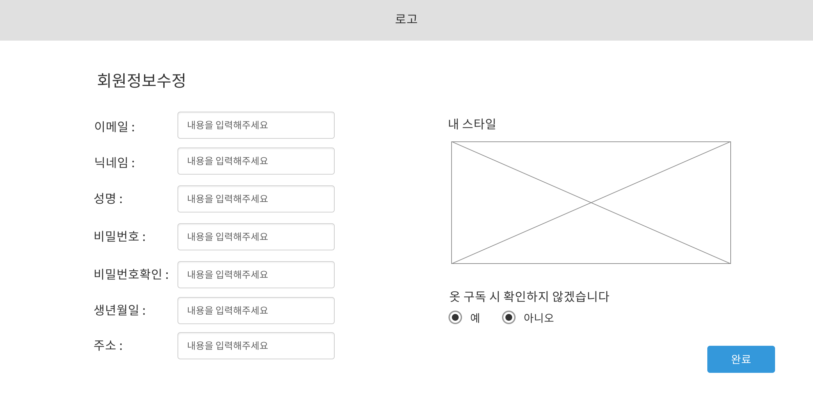

## 랜딩 페이지
LandingPage.js
- 우리 서비스 소개 페이지. 기획 의도나, 웹페이지 기능 사용법 등을 소개한다. 메인 웹사이트로 이동할 수 있는 페이지이다.

## 메인 페이지
MainPage.js
- 메인 페이지에서 전체 옷을 볼 수 있다. 필터를 적용하여 원하는 대분류 / 소분류에 포함되는 옷만 볼 수 있다. 또한, 필터가 적용된 상태로 검색할 수 있다. 

- 오른쪽 사이드 바를 진행중인 프로모션 / 이벤트 등의 공간으로 활용한다.
- 로그인하지 않은 상태이면 로그인 버튼을 반환하고, 로그인 된 상태라면 유저의 프로필사진을 반환하고 유저는 내 옷장, 예약 관리 페이지로 이동할 수 있다.

## 옷 상세 페이지
ClothesDetailPage.js
- 유저가 등록한 옷의 정보를 표현한다.
- 마음에 드는 옷이라면 위시리스트에 추가할 수 있다.
- 셰어러의 옷이 마음에 든다면 그 셰어러의 옷장을 구경할 수 있다.
- 관련상품이나 비슷한 상품을 추천해준다.

## 옷장 페이지
ClosetPage.js
- 나와 내 옷장을 표현해줄 수 있는 페이지이다.
- 내 옷장이라면 프로필을 수정할 수 있고, 타인의 옷장이라면 팔로우할 수 있다.
- 옷장별로 옷을 분류에 맞춰 볼 수 있다.
- 옷장 추가 기능은 확장으로서 필요하다면 추가할 것이다.
- 옷 추가하기 버튼을 누르면 옷 등록 페이지로 이동한다.

## 옷 등록 페이지
ClothesWritePage.js
- 내 옷장에 옷을 등록한다.

## 구독 / 예약 페이지
ReservationPage.js
- 멤버쉽 회원이라면 구독하는 주 단위로 기본적으로 다음 주 리스트를 보여준다.
- 달력에 2주 뒤의 구독이 예약되어있다. 그럴 경우 예약 내역을 클릭하면 2주 뒤 구독 리스트로 보여준다.
- 구독하기 버튼을 누르면 구독을 확정한다.
- 아래의 위시리스트와 추천 리스트에서 드래그 앤 드롭으로 구독 리스트에 추가할 수 있다.

## 로그인 페이지
LoginForm.js
- 회원이 아니라면 회원가입을, 비밀번호를 잊었다면 찾기가 가능하다.
- 소셜 로그인을 지원한다.

## 회원가입 페이지
SignupForm.js
- 회원가입 시 기본적인 인적사항을 받아 다음 페이지로 이동한다.

## 스타일 선택 페이지
ChoiceStylePage.js
- 옷 추천을 위한 스타일을 선택하는 페이지이다. 선택하면 회원가입이 완료된다.

## 회원 정보 수정 페이지
ModifyUserInfoPage.js
- 유저의 인적사항 및 스타일, 구독 확인 여부 등을 수정할 수 있는 페이지이다.

